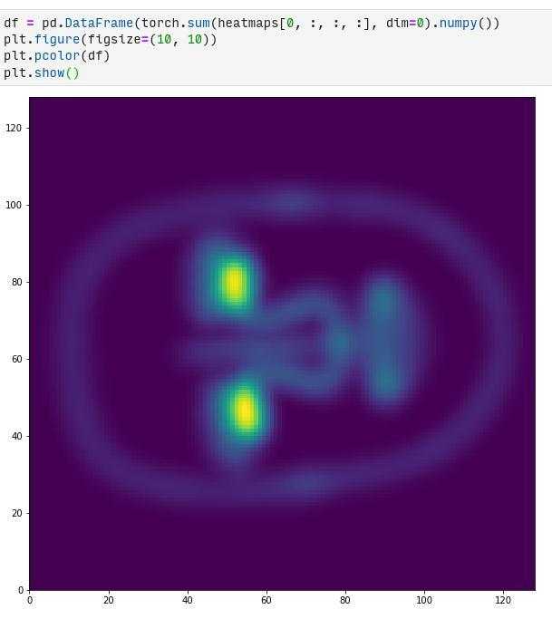
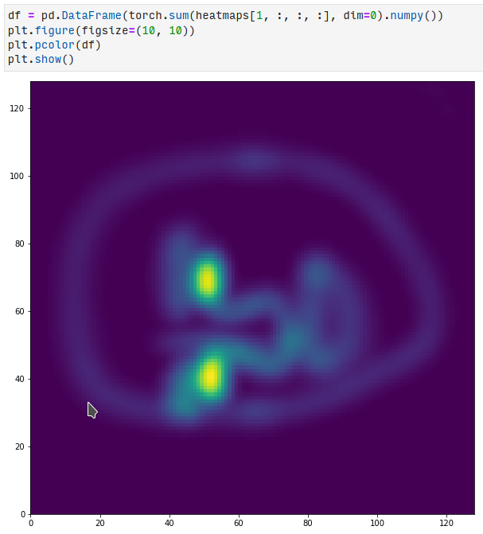
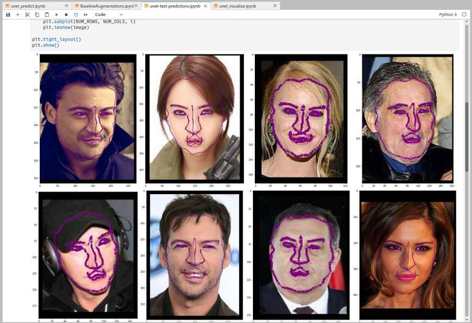
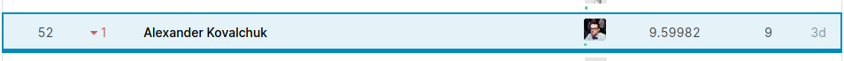

# [Thousand Facial Landmarks](https://www.kaggle.com/c/made-thousand-facial-landmarks/overview)

При участии в соревновании использовал свой ПК с NVME SSD и Nvidia GeForce 1080Ti, 32GB DDR4 RAM.

## Что я пытался делать

- Взял baseline, предоставленный нам в качестве начального кода, заменил backbone с resnet18 на resnet34, что дало MSE около 9.5 на public и private leaderboard'е
- Ускорил загрузку данных dataset'ом (с 5-ти минут до 1-ой минуты, переведя считывание ключевых точек на pandas)
- Прочитал статью [Adaptive Wing Loss for Robust Face Alignment via Heatmap Regression](https://arxiv.org/pdf/1904.07399.pdf)
- Решил попробовать реализовать простой подход с Heatmap Regression на [UNet](https://github.com/milesial/Pytorch-UNet) (см. красивые картинки ниже), в результате чего:
    - Размер батча пришлось уменьшить до 32 (`32 x 971 x 128 x 128`)
    - Одна эпоха стала обучаться около 8 часов (что было еще терпимо)
    - Цикл валидации стал занимать около 2 часов
    - Цикл предсказания стал занимать около 1.5 часов
    

- В результате на выходе сети стал получать набор heatmap'ов (на каждом слое порождалась 2D гауссиана для каждой ключевой точки), из которых как-то было необходимо получить координаты точки:
    - Пробовал брать argmax по 2D тензору
    - Пробовал взвешивать координаты точек по распределению гауссиан, что давало качество лучше, чем простой подход (видимо, позволяло бороться с выбросами в предсказаниях)
- Обучая этот подход с L2 лоссом, **не** удалось получить результат лучше (MSE 10.66), чем был c регрессией точек с resnet34, предположил, что дело в том, что взял слишком большую сигму для гауссианы (7), что порождало их слишком широкими
- Стартовал обучение с весами, которые получались при использовании гауссианы с шириной 7 и стал обучать на гауссиане с шириной 3, в итоге решение плохо сошлось

  
- Решил начать обучение с нуля и добавить [WingLoss/AdaptiveWingLoss](https://github.com/elliottzheng/AdaptiveWingLoss)
    - С этим лоссом батч пришлось сделать еще меньше - 16 (`32 x 971 x 128 x 128`), поскольку он считался на CPU, а 32 гигов RAM для вычисления градиентов с Dataloader (`n_workers=2`) перестало хватать 
    - Одна эпоха стала обучаться 131 час (что уже слишком)
- Уже после окончания соревнования наткнулся на статью про [Mask R-CNN](https://habr.com/ru/company/lanit/blog/500752/), понял, что надо было брать предобученный из `torchvision` и [тюнить](https://pytorch.org/tutorials/intermediate/torchvision_tutorial.html) под нашу задачу, слегка приуныл :(

## Что в итоге

- Хороший опыт для начала
- Понимание того, что не стоит обучать сложные модели с нуля, если в запасе нет очень много времени
- Решение контестов стоит начинать с более детального изучения предобученных моделей
- Слегка менять метод чревато необходимостью обучать все с нуля, а не брать уже предобученные веса, иначе метод может плохо сходиться
- 52 место на Kaggle

